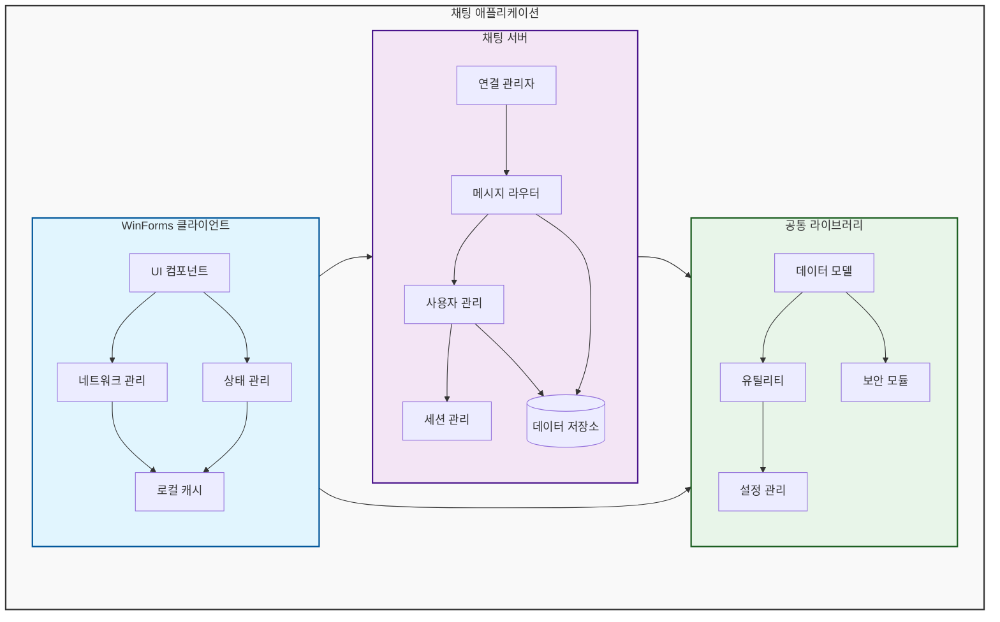
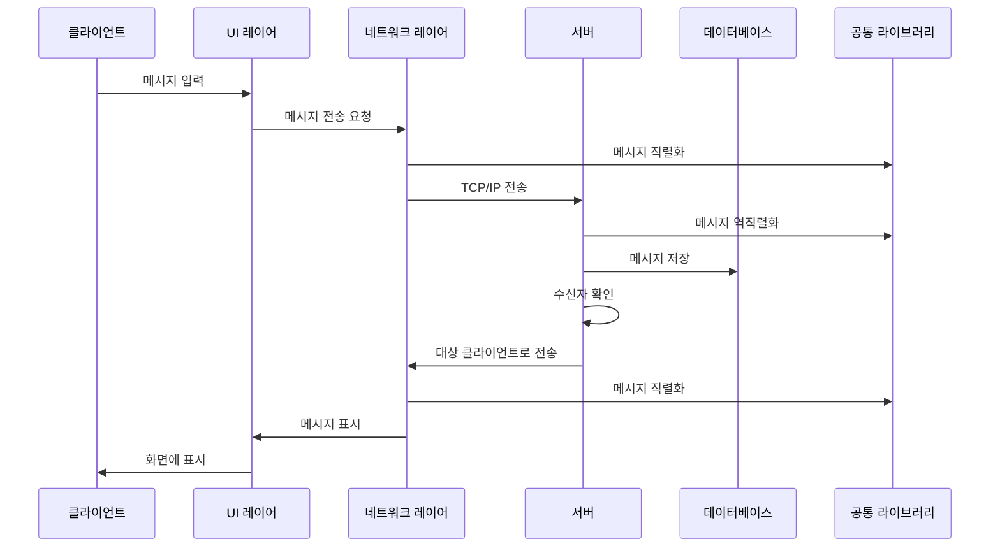
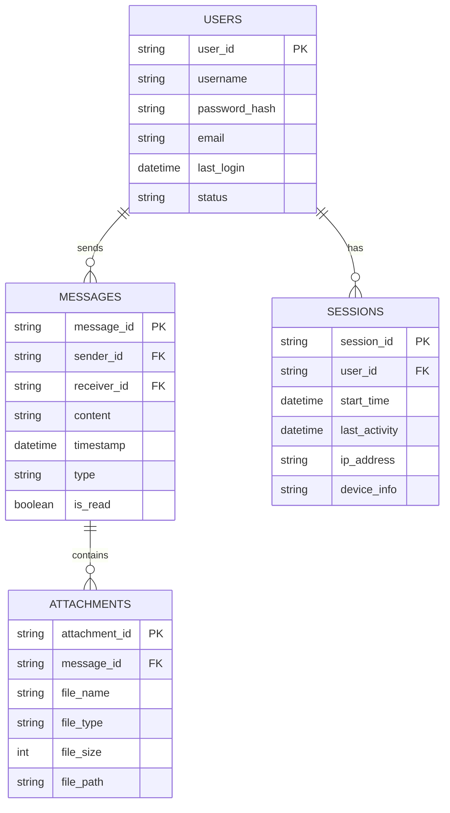
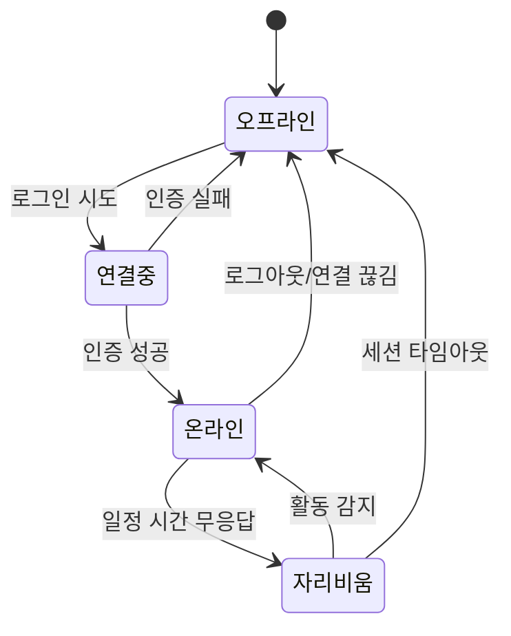

# 채팅 애플리케이션 아키텍처 다이어그램

## 1. 전체 시스템 아키텍처

```mermaid
graph TD
    subgraph ChatApp[채팅 애플리케이션]
        subgraph Client[WinForms 클라이언트]
            UI[UI 컴포넌트]
            Network[네트워크 관리]
            State[상태 관리]
            Cache[로컬 캐시]
            
            UI --> State
            UI --> Network
            Network --> Cache
            State --> Cache
        end

        subgraph Server[채팅 서버]
            ConnectionMgr[연결 관리자]
            MessageRouter[메시지 라우터]
            UserMgr[사용자 관리]
            SessionMgr[세션 관리]
            DB[(데이터 저장소)]
            
            ConnectionMgr --> MessageRouter
            MessageRouter --> UserMgr
            UserMgr --> SessionMgr
            UserMgr --> DB
            MessageRouter --> DB
        end

        subgraph Common[공통 라이브러리]
            Models[데이터 모델]
            Utils[유틸리티]
            Security[보안 모듈]
            Config[설정 관리]
            
            Models --> Utils
            Models --> Security
            Utils --> Config
        end

        Client --> Server
        Server --> Common
        Client --> Common
    end

    style ChatApp fill:#f9f9f9,stroke:#333,stroke-width:2px
    style Client fill:#e1f5fe,stroke:#01579b,stroke-width:2px
    style Server fill:#f3e5f5,stroke:#4a148c,stroke-width:2px
    style Common fill:#e8f5e9,stroke:#1b5e20,stroke-width:2px
```

## 2. 메시지 처리 흐름도

```mermaid
sequenceDiagram
    participant C as 클라이언트
    participant UI as UI 레이어
    participant NL as 네트워크 레이어
    participant S as 서버
    participant DB as 데이터베이스
    participant CL as 공통 라이브러리

    C->>UI: 메시지 입력
    UI->>NL: 메시지 전송 요청
    NL->>CL: 메시지 직렬화
    NL->>S: TCP/IP 전송
    S->>CL: 메시지 역직렬화
    S->>DB: 메시지 저장
    S->>S: 수신자 확인
    S->>NL: 대상 클라이언트로 전송
    NL->>CL: 메시지 직렬화
    NL->>UI: 메시지 표시
    UI->>C: 화면에 표시
```

## 3. 컴포넌트 상세 구조

```mermaid
graph TD
    subgraph ClientComponents[클라이언트 컴포넌트]
        UI_Layer[UI 레이어] --> |사용자 입력| InputHandler[입력 처리기]
        UI_Layer --> |화면 표시| DisplayManager[화면 관리자]
        InputHandler --> |메시지 생성| MessageHandler[메시지 처리기]
        DisplayManager --> |상태 갱신| StateManager[상태 관리자]
        MessageHandler --> |네트워크 전송| NetworkManager[네트워크 관리자]
        StateManager --> |캐시 저장| CacheManager[캐시 관리자]
    end

    subgraph ServerComponents[서버 컴포넌트]
        ConnectionHandler[연결 처리기] --> |세션 생성| SessionManager[세션 관리자]
        MessageRouter[메시지 라우터] --> |사용자 검증| UserManager[사용자 관리자]
        SessionManager --> |상태 관리| StateHandler[상태 처리기]
        UserManager --> |데이터 저장| DatabaseManager[DB 관리자]
        MessageRouter --> |메시지 저장| DatabaseManager
    end

    subgraph CommonLib[공통 라이브러리]
        DataModels[데이터 모델] --> |변환| Serializer[직렬화 도구]
        SecurityModule[보안 모듈] --> |암호화| Serializer
        ConfigManager[설정 관리자] --> |설정 적용| DataModels
        Logger[로깅 도구] --> |기록| DataModels
    end

    style ClientComponents fill:#e3f2fd,stroke:#1565c0,stroke-width:2px
    style ServerComponents fill:#f3e5f5,stroke:#6a1b9a,stroke-width:2px
    style CommonLib fill:#e8f5e9,stroke:#2e7d32,stroke-width:2px
```

## 4. 데이터베이스 구조

```mermaid
erDiagram
    USERS ||--o{ MESSAGES : sends
    USERS ||--o{ SESSIONS : has
    MESSAGES ||--o{ ATTACHMENTS : contains
    USERS {
        string user_id PK
        string username
        string password_hash
        string email
        datetime last_login
        string status
    }
    MESSAGES {
        string message_id PK
        string sender_id FK
        string receiver_id FK
        string content
        datetime timestamp
        string type
        boolean is_read
    }
    SESSIONS {
        string session_id PK
        string user_id FK
        datetime start_time
        datetime last_activity
        string ip_address
        string device_info
    }
    ATTACHMENTS {
        string attachment_id PK
        string message_id FK
        string file_name
        string file_type
        int file_size
        string file_path
    }
```

## 5. 상태 전이 다이어그램

```mermaid
stateDiagram-v2
    [*] --> 오프라인
    오프라인 --> 연결중: 로그인 시도
    연결중 --> 온라인: 인증 성공
    연결중 --> 오프라인: 인증 실패
    온라인 --> 자리비움: 일정 시간 무응답
    자리비움 --> 온라인: 활동 감지
    온라인 --> 오프라인: 로그아웃/연결 끊김
    자리비움 --> 오프라인: 세션 타임아웃
``` 